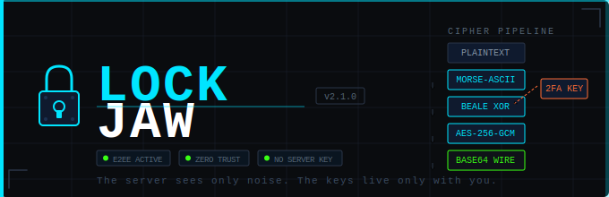

# 🔒 LockJaw

**Hybrid Encryption Messaging System** — Zero-Trust, End-to-End Encrypted, Single-Machine Deployable

```
PLAINTEXT → MORSE-ASCII → BEALE XOR → AES-256-GCM → BASE64 WIRE
```

---

## Overview

LockJaw is a secure messaging system built on a three-layer hybrid encryption pipeline. The server acts as a **pure router** — it never sees plaintext, never stores Beale phrases, and never holds decryption keys. All cryptographic operations happen exclusively on the client nodes.

The encryption architecture is inspired by molecular logic gate principles: unless the exact combination of inputs (Beale phrase + live 2FA code + Machine ID) is supplied, the cipher gate stays closed.

---

## Architecture

### Zero-Trust Model

```
[Node A]                    [Server]                    [Node B]
   |                          |                           |
   |  plaintext               |                           |
   |  -- Morse encode         |                           |
   |  -- Beale XOR            |                           |
   |  -- AES-256-GCM          |                           |
   |  -- Base64               |                           |
   |---- ciphertext --------> |---- ciphertext ---------->|
   |                          |  (server sees only noise) |  -> AES-256-GCM decrypt
   |                          |                           |  -> Beale unscramble
   |                          |                           |  -> Morse decode
   |                          |                           |  -> plaintext
```

### Cipher Pipeline

| Layer  | Operation | Detail |
|--------|-----------|--------|
| **A**  | Morse-ASCII encoding | Plaintext → ASCII integers → Morse symbols → Binary string |
| **B**  | Beale XOR scramble | HMAC-SHA256 key stream derived from the shared Beale phrase XORs the binary string |
| **C**  | AES-256-GCM | Session key Ke wraps the Beale output with authenticated encryption |
| **TX** | Base64 transmission | Ciphertext + nonce sent as JSON over WebSocket |

### Session Key Derivation

```
Ke = HKDF-SHA256(
  IKM  = SHA256(machine_id || totp_code || beale_phrase),
  salt = "LockJawSaltV1",
  info = "lockjaw-session-key",
  len  = 32 bytes
)
```

### Component Map

```
lockjaw/
├── server/
│   └── app.py              <- FastAPI server + WebSocket router
├── crypto/
│   └── hybrid_cipher.py    <- Full cipher pipeline (Morse + Beale + AES-256-GCM)
├── auth/
│   ├── totp_manager.py     <- TOTP provisioning & verification (RFC 6238)
│   └── session_manager.py  <- Post-2FA session token lifecycle
├── config/
│   └── settings.py         <- Environment-driven configuration
├── client/
│   └── client.py           <- Python CLI node (send/receive)
├── tests/
│   └── test_cipher.py      <- Cipher unit tests
├── .env.example            <- Environment template
├── requirements.txt        <- Python dependencies
├── Dockerfile
└── docker-compose.yml
```

---

## Security Properties

### Strengths

- **End-to-End Encryption** — Server is a blind router. No plaintext ever leaves the originating node.
- **2FA Interlock** — Message decryption requires a time-valid TOTP code. Compromised machines cannot decrypt past sessions once the TOTP window expires.
- **No Central Key Storage** — Beale phrases are never transmitted to or stored on the server.
- **AES-256-GCM Authentication** — Provides both confidentiality and integrity. Any tampered ciphertext fails decryption.
- **Defense-in-Depth** — An attacker must simultaneously obtain the Beale phrase, a valid TOTP code, and the Machine ID.

### Limitations

- The Beale phrase is a shared secret that must be exchanged out-of-band.
- TOTP codes are time-windows (~30s). The 2FA interlock protects against future decryption, not an active MITM with live code access.
- For production: replace the shelve TOTP store with an encrypted database and add rate limiting to auth endpoints.

---

## API Reference

### REST

| Method | Path | Description |
|--------|------|-------------|
| `GET`  | `/health` | Server health + online node count |
| `POST` | `/api/auth/register` | Register a node, receive TOTP secret + OTPAuth URI |
| `POST` | `/api/auth/verify` | Verify TOTP code, receive session token |
| `GET`  | `/api/nodes/online` | List currently connected nodes |

### WebSocket

Connect: `ws://host:8765/ws/{NODE_ID}`

**Send a message:**
```json
{
  "type": "MSG",
  "to": "TARGET_NODE",
  "ciphertext": "<base64>",
  "nonce": "<base64>"
}
```

**Receive a message:**
```json
{
  "type": "MSG",
  "from": "SENDER_NODE",
  "ciphertext": "<base64>",
  "nonce": "<base64>",
  "ts": "2025-01-01T00:00:00"
}
```

**Other message types:** `PING/PONG`, `WHO/NODES`, `PEER_ONLINE`, `PEER_OFFLINE`, `ERROR`

---

## Running Tests

```bash
pip install -r requirements.txt
pytest tests/ -v
```

---

## Technology Stack

| Layer | Technology |
|-------|-----------|
| Server framework | FastAPI + Uvicorn |
| WebSocket | websockets (asyncio native) |
| Encryption | cryptography (AES-256-GCM, HKDF) |
| 2FA / TOTP | pyotp (RFC 6238) |
| CLI client | websockets + httpx |
| Container | Docker + docker-compose |

---

> **LockJaw** — *The server sees only noise. The keys live only with you.*
